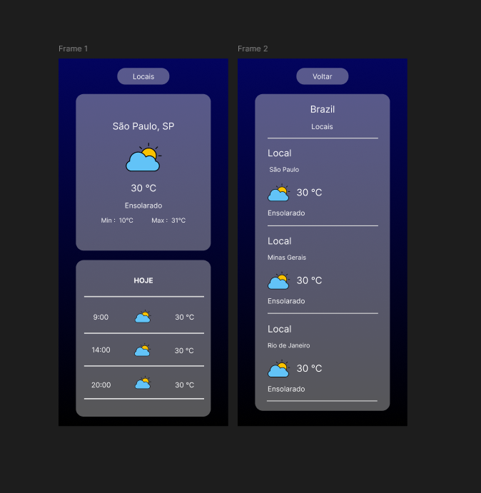

# 🌤️ ClimaApp React

Aplicação web que exibe as condições climáticas em tempo real de cidades brasileiras, com previsão do tempo para manhã, tarde e noite.

---

## 📸 Preview



---

## 🚀 Funcionalidades

- Exibe temperatura atual, mínima e máxima do dia
- Mostra condição climática com ícone em tempo real
- Previsão do tempo para 3 períodos do dia (manhã, tarde e noite)
- Tela de locais com clima de 3 estados brasileiros (SP, RJ e MG)
- Navegação entre telas

---

## 🛠️ Tecnologias

- React 19
- Vite
- React Router DOM
- CSS Modules
- [WeatherAPI](https://www.weatherapi.com/) — API de clima em tempo real

---

## 📁 Estrutura do Projeto

```
src/
├── components/
│   ├── Button/
│   ├── Container/
│   ├── ContainerContent/
│   └── TempoAtual/
├── pages/
│   ├── Home.jsx
│   └── Locais.jsx
├── services/
│   └── clima.js
└── App.jsx
```

---

## ⚙️ Como rodar localmente

1. Clone o repositório:
```bash
git clone https://github.com/J0A0PAULO/ClimaApp-React.git
```

2. Instale as dependências:
```bash
cd ClimaApp-React
npm install
```

3. Rode o projeto:
```bash
npm run dev
```

---

## 🌐 Deploy

Acesse o projeto em produção:

> Link do deploy — adicione após publicar na Netlify

---

## 👨‍💻 Autor

Feito por [J0A0PAULO](https://github.com/J0A0PAULO)